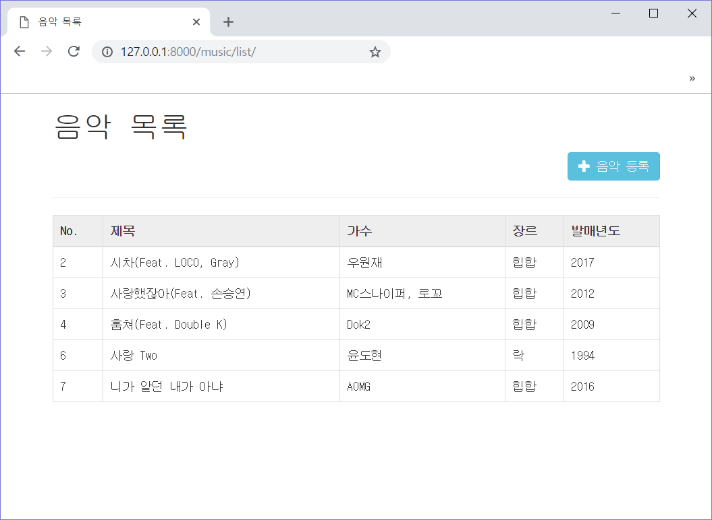
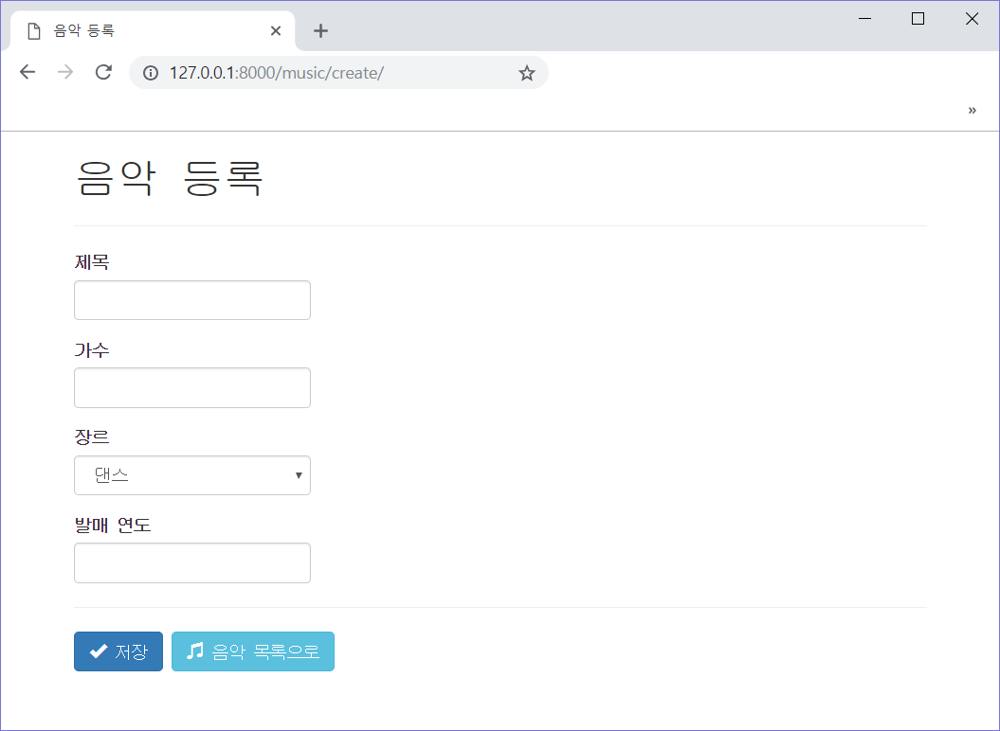
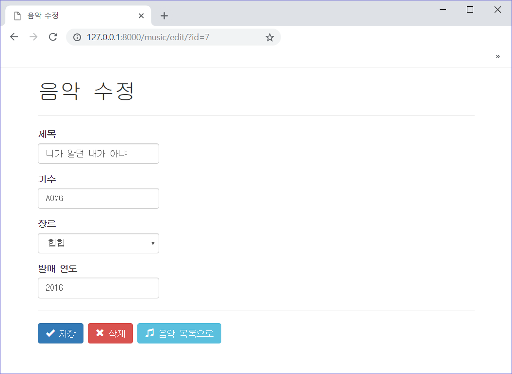
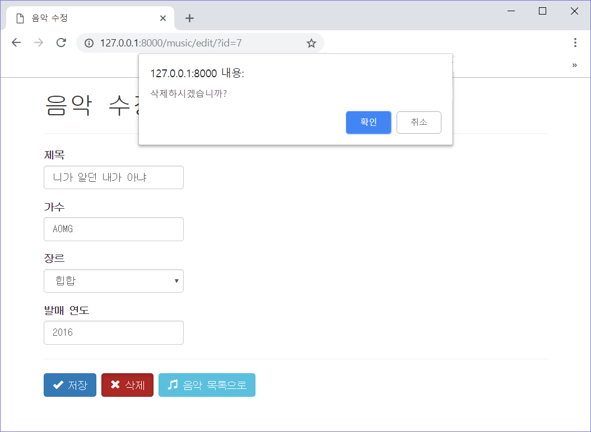

# First Example Of django

Python django Framework 를 이용해서 간단한 음악 목록을 관리하는 프로젝트를 제작하였습니다.

프로젝트 구성은 고급 웹 프로그래밍 1, 2 시간에 배우는 예제와 거의 비스듬한 구성으로 진행하였습니다.

실행 결과 파일은 기본 개념 설명 이후 하단을 참고하시면 도움 됩니다.

## Preview

- 음반 목록 조회 기능

- 음반 추가와 수정 기능

- 음반 삭제 기능

